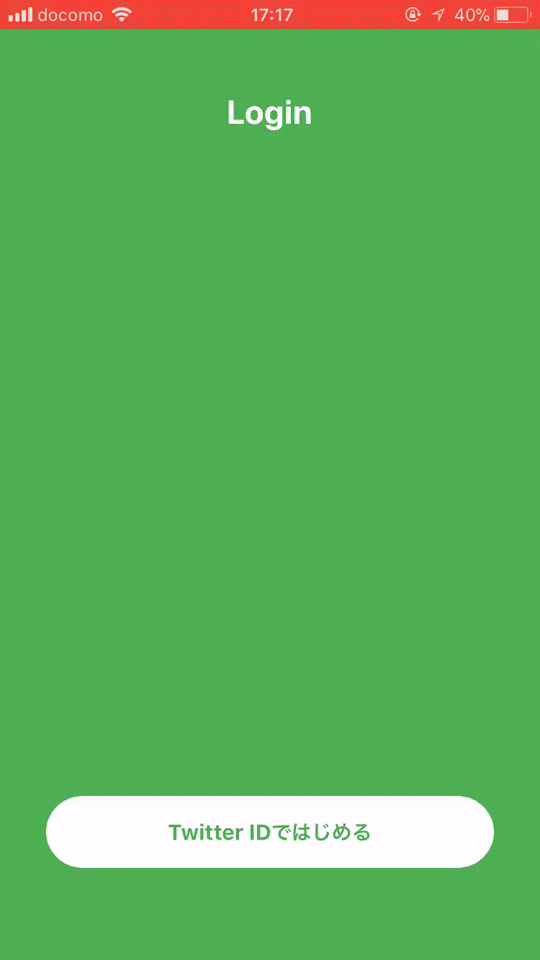

**If you have request, Please send a PR or issue.**

# React-Native-Simple-Twitter v2.0
Twitter API client for React Native without `react-native link`.  
This client not use NativeModule, only pure javascript.  
So this don't use `react-native link` and [Expo](https://expo.io) can also easily use twitter API without auth0 and server.  
  
And also offer login button,so that is easily login twitter.  
Button is customizable, and including login webview.  
  
Checkout [example](example).  
  
Previous version -> [v1.2.4](https://github.com/watanabeyu/react-native-simple-twitter/tree/v1.2.4)

## Installation
```bash
npm install react-native-simple-twitter --save
```

## Features
* Not use NativeModules, only pure javascript
* Simple API client
* Just put a button to login
* Customizable login button
* Compatible with SafeAreaView

## Demo


## TWLoginButton props

| Name | Type| Default | Description |
| --- | --- | --- | --- |
| type | string | TouchableOpacity | TouchableOpacity or TouchableHighlight or TouchableWithoutFeedback |
| children | React.Component |  |  |
| callbackUrl | string | null | Twitter application callback url |
| closeText | string | 'close' | default header's close text |
| headerColor | string | '#f7f7f7' | Webview's modal and SafeAreaView backgroundColor |
| onPress | func | (e) => {} | Called when login button on Press | 
| onGetAccessToken | func | ({oauth_token,oauth_token_secret}) => {} | Called when get access token |
| onClose | func | () => {} | Called when press close button |
| onSuccess | func | (user) => {} | Called when logged in and get user account |
| onError | func | (e) => {} | Called when on error |
| renderHeader | func | (props:{onClose:(e:any) => void}) => React.Component | If you use original Header Component,use this props |

I changed `TWLoginButton` to React.Component(TouchableOpacity or TouchableHighlight or TouchableWithoutFeedback).  
So you can use each props and customize.

## Client API

* `twitter.setConsumerKey(consumer_key,consumer_key_secret)` - set application key and secret.
* `twitter.setAccessToken(access_token,access_token_secret)` - set user access_token and access_token_secret, when you already have access_token and access_token_secret.
* `twitter.getLoginUrl(callback_url)` - get login url for authorize app.
* `twitter.getAccessToken(oauth_verifier)` - get access_token and access_token_secret, when user logged in app.
* `twitter.api(method,endpoint,parameters)` - call twitter api.
* `twitter.get(endpoint,parameters)` - call twitter get api.
* `twitter.post(endpoint,parameters)` - call twitter post api.

## Other API

* decodeHTMLEntities
```js
import { decodeHTMLEntities } from 'react-native-simple-twitter'

console.log(decodeHTMLEntities("&amp; &apos; &#x27; &#x2F; &#39; &#47; &lt; &gt; &nbsp; &quot;"))
```
Tweet is include htmlencoded characters.  
So this function decode special characters.

* getRelativeTime
```js
import { getRelativeTime } from 'react-native-simple-twitter'

console.log(getRelativeTime(new Date(new Date().getTime() - 32390)))
console.log(getRelativeTime("Thu Apr 06 15:28:43 +0000 2017"))
```
Tweet created_at convert to relative time.
ex) 1s 15m 23h